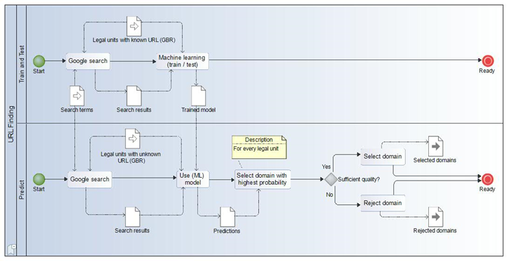

# urlfinding
Generic software for finding websites of enterprises using a search engine and machine learning.

This repo is still work in progress, i.e. the training function will be documented later.

## Introduction
This repository contains the software that was used for research on finding enterprise websites.
For a detailed description of the methodology implemented we refer to the
discussion paper on this subject from Statistics Netherlands:

[Searching for business websites](https://www.cbs.nl/en-gb/background/2020/01/searching-for-business-websites) by Arnout van Delden, Dick Windmeijer and Olav ten Bosch

In short the software operates as follows:
* training a model for finding websites using google search for predicting in the train and test phase
* applying the trained model to a dataset with unknown URLs using google search in the predict phase

This process model is shown in the figure below:


It is possible to skip the train and test phase and use the pre-trained model that is provided in this repository.

## Google Search IDs

This software uses the *[Google custom search JSON API](https://developers.google.com/custom-search)*
which offers 100 search queries per day for free. Use the paid version if you need more.

To get started configure a custom search engine and get your API key from [here](https://developers.google.com/custom-search/v1/overview).
Make sure to enable the search engine feature 'Search whole internet'.
Then add the API key and the search engine ID to the `config.yml`.

## Install urlfinding

Assuming an up-to-date Python Anaconda distribution, use the following commands to install urlfinding from your anaconda prompt:
```bash
git clone https://github.com/SNStatComp/urlfinding.git # or download and unzip this repository
cd urlfinding
python setup.py install
```
## Quick start: finding websites of NSIs

The examples folder contains a working example.
One needs two folders, one named `data` for the data, features, blacklist and features and one named `config` for the two configuration files: `config.yml` and `mappings.yml`.
The example runs in a Python notebook [examples/nsis.ipynb](examples/nsis.ipynb) showing how to search for websites of National Statistical Offices (NSIs) using the pre-trained model provided in this repo.

## API

Include the `urlfinding` module as follows:
```
import urlfinding as uf
```
Then you have the following functions:

### Search

`uf.search(base_file, googleconfig, blacklist, nrows)`

This function startes a Google search.

- `base_file`: A .csv file with a list of enterprises for which you want to find the webaddress. If you want to use the pretrained ML model provided (data/model.pkl_) the file must at least include the following columns: _id, tradename, legalname, address, postalcode and municipality. The column names can be specified in a mapping file (see config/mappings.yml for an example).
The legal name can be the same as the tradename if you have only one name.

- `googleconfig`: This file contains your credentials for using the Google custom search engine API

- `blacklist`: A file containing urls you want to exclude from your search

- `nrows`: Number of records to process. Google provides 100 queries per day for free. The urlfinding software issues 6 queries per record (see methodology paper reference above). Thus for example 10 enterprises 6 * 10 = 60 queries are fired. Every query returns at most 10 search results.

This function creates a file (<YYYYMMDD_>_searchResult.csv_) in the _data folder containing the search results, where YYYYMMDD is the current date.

To facilitate splitting up multiple search sessions on bigger data files, the search function creates a file `maxrownum` in the project folder which contains the id of the record that was processed last. The search function will read this file upon startup and start on the next record. Hence, if you want to start again from the beginning of a file either remove the `maxrownum` file or replace its content with 0.


### Extract

`uf.extract(date, data_files, blacklist)`

This function extracts a feature file to be used for training your Machine Learning model or predicting using your an already trained model.


- `date`: Used for adding a 'timestamp' to the name of the created feature file

- `data_files`: list of files containing the search results

- `blacklist`: see above

This function creates the feature file <YYYYMMDD_>_features___agg.csv in the data folder


### Predict

`uf.predict(feature_file, model_file, base_file)`

This function predicts urls using a previously trained ML model.

- `feature_file`: file containing the features

- `model_file`: Pickle file containing the ML model (created with our package)

- `base_file`: See base_file at `uf.scrape.start()`

This function creates the file <base__file>_url.csv in the data folder containing the predicted urls. This file contains all data from the base file with 3 columns added:

- `host`: the predicted url

- `eqPred`: An indicator showing whether the predicted url is the right one

- `pTrue`: An indicator showing the confidence of the prediction, a number between 0 and 1 where 0: almost certain not the url and 1: almost certain the right url. eqPred is derived from pTrue: if pTrue>0.5 then eqPred=True else eqPred=False

### Train

`uf.train(date, data_file, save_model, visualize_scores)`

This function trains a classifier accoring to the specification in the `train` block of the mapping file `mappings.yml`.
There you can specify the classifier to train and the features and hyperparameters to use for this classifier.

- `date`: Used for adding a 'timestamp' to the name of the created model file
- `data_file`: The file containing the training data
- `save_model`: If True, saves the model (default: True)
- `visualize_scores`: If True, shows and saves figures containing performance measures (classification report, confusionmatrix, precision recall curve and ROCAUC curve).
The figures are saved in the folder 'figures'. (default: False)

## Release notes
The improvements between different releases have been documented [here](RELEASE_NOTES.txt).


## Limitations
- The urlfinding returns domains of length 2 only, i.e. no subdomains of cbs.nl